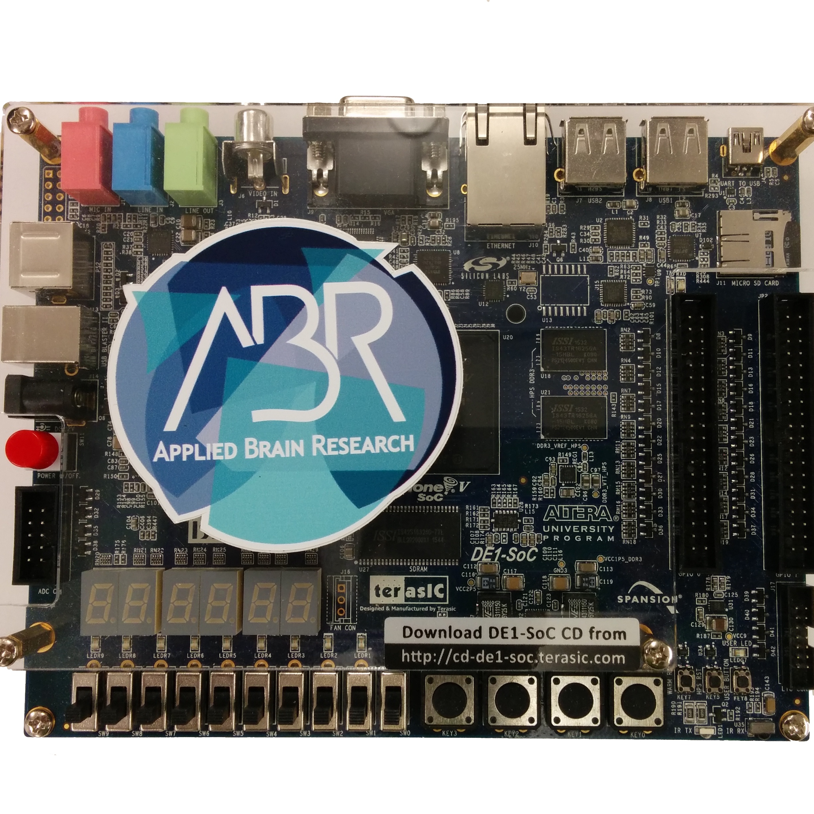
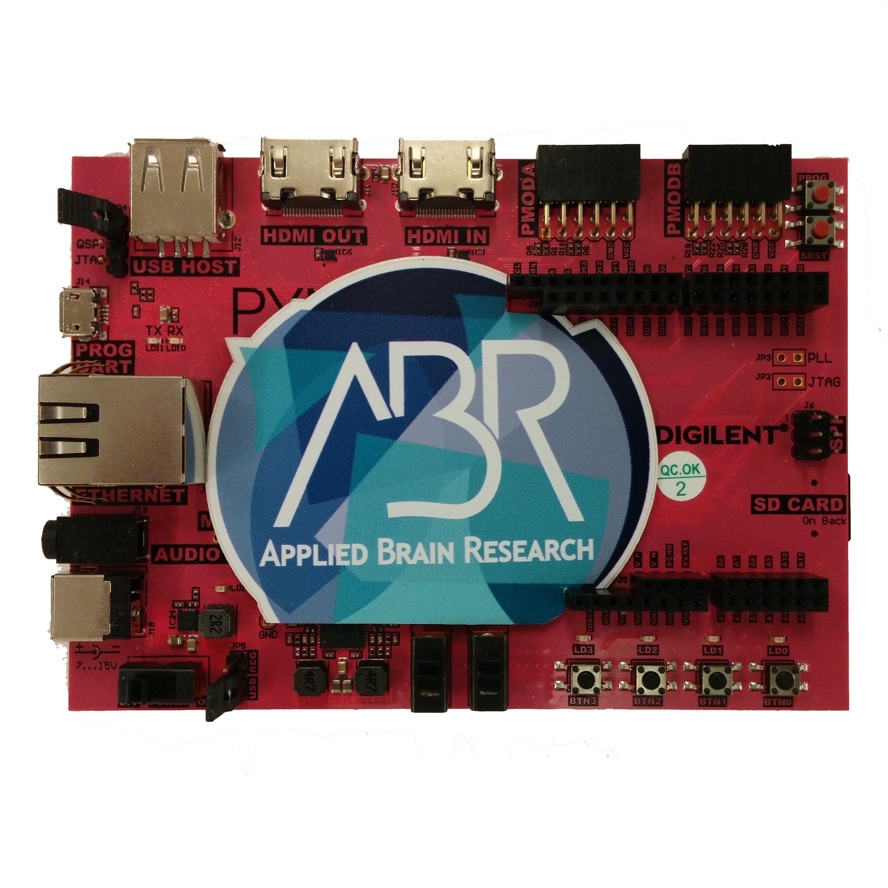

******************
Supported Hardware
******************

.. todo::
   - somewhere we may want to say you can buy boards from us, or just the SD image/IP?

The DE1-SoC board (left) is manufactured by Terasic and uses an Intel Altera Cyclone V FPGA paired with an dual core ARM Cortex A9. (`DE1 docs <https://www.nengo.ai/nengo-de1/>`_)

The PYNQ board (right) is manufactured by Digilent and uses a ZYNQ 7020 FPGA paired with a dual core ARM Cortex A9. (`PYNQ docs <https://www.nengo.ai/nengo-pynq/>`_)

Boards can be purchased through `Applied Brain Research <https://appliedbrainresearch.com/products/#board>`_.

